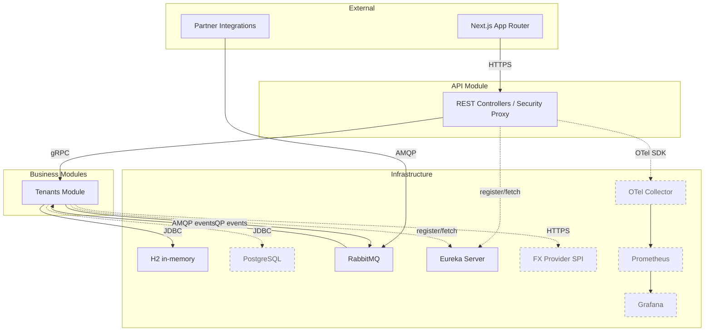

# C4 — Containers

```mermaid
flowchart TB
  %% Classes
  classDef roadmap stroke-dasharray: 5 5,stroke:#888,color:#666;

  subgraph External
    FE[Next.js App Router]
    Partners[Partner Integrations]
  end

  subgraph API[API Module]
    REST[REST Controllers / Security Proxy]
  end

  subgraph Modules[Business Modules]
    Tenants[Tenants Module]
  end

  subgraph Infra[Infrastructure]
    H2[H2 in-memory]
    PG[PostgreSQL]
    RMQ[RabbitMQ]
    Eureka[Eureka Server]
    FX[FX Provider SPI]
    OTel[OTel Collector]
    Prom[Prometheus]
    Graf[Grafana]
  end

  %% External to API
  FE -->|HTTPS| REST
  Partners -->|AMQP| RMQ

  %% API to Modules
  REST -->|gRPC| Tenants

  %% Messaging
  Tenants -->|AMQP events| RMQ
  RMQ -->|AMQP events| Tenants

  %% Persistence
  Tenants -->|JDBC| H2
  Tenants -. JDBC .-> PG

  %% Service Discovery
  REST -. register/fetch .-> Eureka
  Tenants -. register/fetch .-> Eureka

  %% Observability (roadmap)
  REST -. OTel SDK .-> OTel
  OTel --> Prom
  Prom --> Graf

  %% FX Provider SPI (roadmap)
  Tenants -. HTTPS .-> FX

  %% Style roadmap elements
  class PG,OTel,Prom,Graf,FX roadmap;
```
