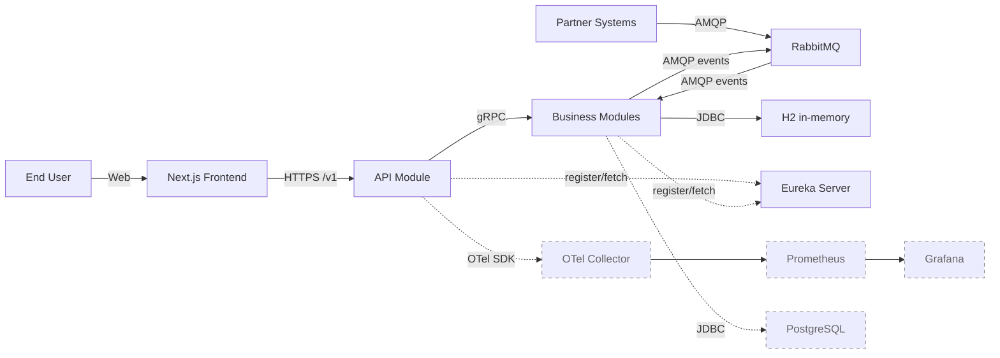

# C4 — System Context

```mermaid
flowchart LR
  %% Classes
  classDef roadmap stroke-dasharray: 5 5,stroke:#888,color:#666;

  User[End User] -->|Web| NextJS[Next.js Frontend]
  NextJS -->|HTTPS /v1| API[API Module]

  %% Partners interact via RabbitMQ (AMQP)
  Partner[Partner Systems] -->|AMQP| RMQ[RabbitMQ]

  %% Core interactions within the platform
  API -->|gRPC| Modules[Business Modules]
  Modules -->|JDBC| H2[H2 in-memory]
  Modules -->|AMQP events| RMQ
  RMQ -->|AMQP events| Modules

  %% Service discovery (Eureka within our platform)
  API -. register/fetch .-> Eureka[Eureka Server]
  Modules -. register/fetch .-> Eureka

  %% Observability (roadmap)
  API -. OTel SDK .-> OTel[OTel Collector]
  OTel --> Prom[Prometheus]
  Prom --> Graf[Grafana]

  %% Future data store (roadmap)
  Modules -. JDBC .-> PG[PostgreSQL]

  %% Styling roadmap elements
  class OTel,Prom,Graf,PG roadmap;
```
